# Layout Containers

## [AbsoluteLayout]()
The AbsoluteLayout is the simplest layout in NativeScript. It uses absolute left-top coordinates to position its children. The AbsoluteLayout will not enforce any layout constraints on its children and will not resize them at runtime when its size changes.

### AbsoluteLayout Properties
None.

### Child Properties
| Property | Description |
| -------- | ------------|
| left     | Gets or sets the distance, in pixels, between the left edge of the child and the left edge of its parent AbsoluteLayout client area. |
| top     | Gets or sets the distance, in pixels, between the top edge of the child and the top edge of its parent AbsoluteLayout client area. |


```XML
<Page xmlns="http://schemas.nativescript.org/tns.xsd">
 <AbsoluteLayout width="210" height="210" backgroundColor="lightgray">
   <Label text="10, 10" left="10" top="10" width="90" height="90" backgroundColor="red"/>
   <Label text="110, 10" left="110" top="10" width="90" height="90" backgroundColor="green"/>
   <Label text="110, 110" left="110" top="110" width="90" height="90" backgroundColor="blue"/>
   <Label text="10, 110" left="10" top="110" width="90" height="90" backgroundColor="yellow"/>
 </AbsoluteLayout>
</Page>
```





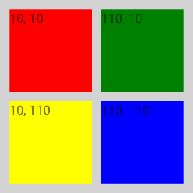


```XML
<Page xmlns="http://schemas.nativescript.org/tns.xsd">
  <AbsoluteLayout width="210" height="210" backgroundColor="lightgray">
    <Label text="no margin" left="10" top="10" width="100" height="100" backgroundColor="red"/>
    <Label text="margin='30'" left="10" top="10" margin="30" width="100" height="90" backgroundColor="green"/>
  </AbsoluteLayout>
</Page>
```





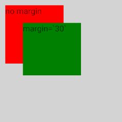

## [DockLayout]()
The DockLayout is a layout that provides a docking mechanism for child elements to the left, right, top, bottom or center of the layout. To define the docking side of a child element, use its `dock` property. To dock a child element to the center of the DockLayout, it must be the last child of the DockLayout and the `stretchLastChild` property of the DockLayout must be set to `true`.

### DockLayout Properties
| Property | Description |
| -------- | ------------|
| stretchLastChild | Gets or sets a value that indicates whether the last child element within a DockLayout stretches to fill the remaining available space. The default value is `true`. |

### Child Properties
| Property | Description |
| -------- | ------------|
| dock     | Specifies the Dock position of a child element that is inside a DockLayout. Possible values are `left`, `top`, `right` and `bottom`. |

_Example for `stretchLastChild="false"`_

```XML
<Page xmlns="http://schemas.nativescript.org/tns.xsd">
  <DockLayout width="210" height="210" backgroundColor="lightgray" stretchLastChild="false">
    <Label text="left" dock="left" width="60" backgroundColor="red"/>
    <Label text="top" dock="top" height="60" backgroundColor="green"/>
    <Label text="right" dock="right" width="60" backgroundColor="blue"/>
    <Label text="bottom" dock="bottom" height="60" backgroundColor="yellow"/>
  </DockLayout>
</Page>
```





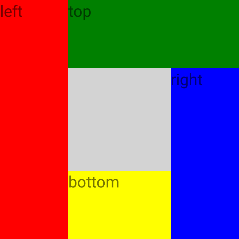

_Example for `stretchLastChild="true"`_

```XML
<Page xmlns="http://schemas.nativescript.org/tns.xsd">
  <DockLayout width="210" height="210" backgroundColor="lightgray" stretchLastChild="true">
    <Label text="left" dock="left" backgroundColor="red"/>
    <Label text="top" dock="top" backgroundColor="green"/>
    <Label text="right" dock="right" backgroundColor="blue"/>
    <Label text="bottom" dock="bottom" backgroundColor="yellow"/>
  </DockLayout>
</Page>
```





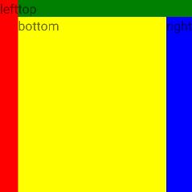

_Example for multiple child elements on one side_

```XML
<Page xmlns="http://schemas.nativescript.org/tns.xsd">
  <DockLayout width="210" height="210" backgroundColor="lightgray" stretchLastChild="true">
    <Label text="left1" dock="left" backgroundColor="red"/>
    <Label text="left2" dock="left" backgroundColor="green"/>
    <Label text="left3" dock="left" backgroundColor="blue"/>
    <Label text="last child" backgroundColor="yellow"/>
  </DockLayout>
</Page>
```





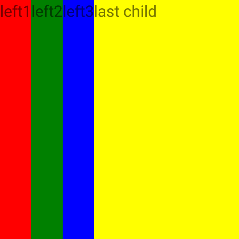

## [GridLayout]()
The GridLayout is a layout that arranges its child elements in a table structure of rows and columns. A cell can contain multiple child elements, they can span over multiple rows and columns, and even overlap each other. The GridLayout has one column and one row by default. To add additional columns and rows, you have to specify column definition items (separated by commas) to the `columns` property and row definition items (separated by commas) to the `rows` property of the GridLayout. The width of a column and the height of a row can be specified as an absolute amount of pixels, as a percentage of the available space or automatically:
- **Absolute**: Fixed size of pixels.
- **Star (\*)**: Takes as much space as available (after filling all auto and fixed sized columns), proportionally divided over all star-sized columns. So 3*/7* means the same as 30*/70*.
- **Auto**: Takes as much space as needed by the contained child element(s).

### GridLayout Properties
| Property | Description |
| -------- | ------------|
| columns  | A string value representing column widths delimited with commas. Column widths can be either an absolute `number`, `auto` or `*`. A `number` indicates an absolute column width, `auto` makes the column as wide as its widest child, and `*` makes the column occupy all available horizontal space. |
| rows  | A string value representing row heights delimited with commas. Row heights can be either an absolute `number`, `auto` or `*`. A `number` indicates an absolute row height, `auto` makes the row as high as its highest child, and `*` makes the row occupy all available vertical space. |

### Child Properties
| Property | Description |
| -------- | ------------|
| row      | Gets or sets a value that indicates which row child content within a GridLayout it should appear in. |
| col      | Gets or sets a value that indicates which column child content within a GridLayout it should appear in. |
| rowSpan  | Gets or sets a value that indicates the total number of rows that child content spans within a GridLayout. |
| colSpan  | Gets or sets a value that indicates the total number of columns that child content spans within a GridLayout. |

_Example for basic Grid usage_

```XML
<Page xmlns="http://schemas.nativescript.org/tns.xsd">
  <GridLayout columns="50, auto, *" rows="50, auto, *" width="210" height="210" backgroundColor="lightgray" >
    <Label text="Label 1" row="0" col="0" backgroundColor="red"/>
    <Label text="Label 2" row="0" col="1" colSpan="2" backgroundColor="green"/>
    <Label text="Label 3" row="1" col="0" rowSpan="2" backgroundColor="blue"/>
    <Label text="Label 4" row="1" col="1" backgroundColor="yellow"/>
    <Label text="Label 5" row="1" col="2" backgroundColor="orange"/>
    <Label text="Label 6" row="2" col="1" backgroundColor="pink"/>
    <Label text="Label 7" row="2" col="2" backgroundColor="purple"/>
  </GridLayout>
</Page>
```





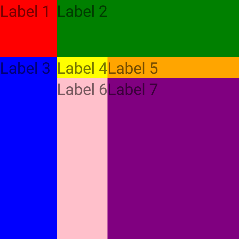

_Example for sizing with star (`*`)_
- Columns: One star plus two stars is equal to three stars. (\* + 2\* = 3\*). Divide GridLayout width (300) by 3 to get 100. So first column is 1 x 100 = 100 pixels wide and second column is 2 x 100 = 200 pixels wide. 100 + 200 = 300.
- Rows: Two stars plus three stars is equal to five stars. (2\* + 3\* = 5\*). Divide GridLayout height (300) by 5 to get 60. So first row is 2 x 60 = 120 pixels high and second row is 3 x 60 = 180 pixels high. 120 + 180 = 300.

```XML
<Page xmlns="http://schemas.nativescript.org/tns.xsd">
  <GridLayout columns="*,2*" rows="2*,3*" width="300" height="300" backgroundColor="lightgray" >
    <Label text="Label 1" col="0" row="0" backgroundColor="red"/>
    <Label text="Label 2" col="1" row="0" backgroundColor="green"/>
    <Label text="Label 3" col="0" row="1" backgroundColor="blue"/>
    <Label text="Label 4" col="1" row="1" backgroundColor="yellow"/>
  </GridLayout>
</Page>
```





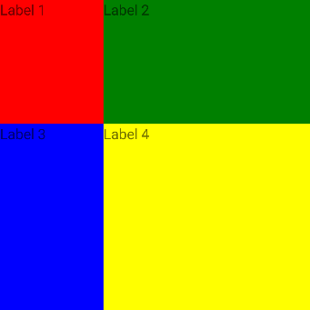

_Example for fixed and auto sizing_
- The first column and the first row are `auto`. This means that they are measured with infinite available space and then sized to their content.
- The first column and the first row have fixed sizes of 100 and 100 respectively. They will be exactly this wide/high regardless of their children's dimensions. They would still be exactly this wide/high even if they don't have any children.

```XML
<Page xmlns="http://schemas.nativescript.org/tns.xsd">
  <GridLayout columns="100,auto" rows="100,auto" width="210" height="210" backgroundColor="lightgray" >
    <Label text="Label 1" col="0" row="0" backgroundColor="red"/>
    <Label text="Label 2" col="1" row="0" backgroundColor="green"/>
    <Label text="Label 3" col="0" row="1" backgroundColor="blue"/>
    <Label text="Label 4" col="1" row="1" backgroundColor="yellow"/>
  </GridLayout>
</Page>
```





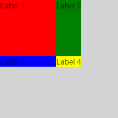

_Example for no width and horizontalAlignment != stretch_
When the GridLayout has no explicit `width` set and its `horizontalAlignment` is not `stretch`, the star columns will not occupy the entire available space (200 from parent StackLayout).


```XML
<Page xmlns="http://schemas.nativescript.org/tns.xsd">
  <StackLayout width="200" height="200" backgroundColor="palegreen">
    <GridLayout columns="*,2*" horizontalAlignment="left" verticalAlignment="top" backgroundColor="lightgray">
      <Label text="Label 1" col="0" backgroundColor="red"/>
      <Label text="Label 2" col="1" backgroundColor="green"/>
    </GridLayout>
  </StackLayout>
</Page>
```





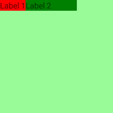

_Example for column stretching_
Label 3 has a fixed width of 150 pixels. Label 1 is given more space than it actually needs, because Label 3 stretches the auto column.

```XML
<Page xmlns="http://schemas.nativescript.org/tns.xsd">
  <GridLayout columns="auto,100" rows="auto,auto" width="300" height="300" backgroundColor="lightgray" >
    <Label text="Label 1" col="0" row="0" backgroundColor="red"/>
    <Label text="Label 2" col="1" row="0" backgroundColor="green"/>
    <Label text="Label 3" width="150" col="0" row="1" backgroundColor="blue"/>
  </GridLayout>
</Page>
```





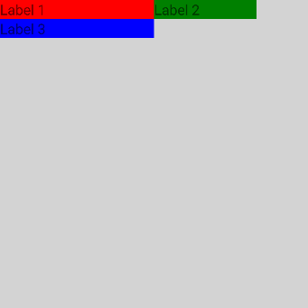

_Example for complex structure
`Image` has fixed width and height of 72 and span the both rows. For the first `Label` is given more space by using `colSpan="2"`. Third `Lable` is given more space than it actually needs, because fourth `Label` stretches the auto column.


```XML
<Page xmlns="http://schemas.nativescript.org/tns.xsd">
  <GridLayout columns="auto, *, auto" rows="auto, 25" verticalAlignment="top" backgroundColor="lightgray">
    <Image src="~/cute.jpg" rowSpan="2" width="72" height="72" margin="3" verticalAlignment="top"/>
    <Label text="My cat loves the camera" textWrap="true" col="1" colSpan="2" minHeight="50" fontSize="20" margin="3"/>
    <Label text="John Smith" col="1" row="1" fontSize="14" horizontalAlignment="left" verticalAlignment="bottom" margin="3"/>
    <Label text="comments: 26" col="2" row="1" color="#10C2B0" fontSize="14" verticalAlignment="bottom" margin="3"/>
  </GridLayout>
</Page>
```






_Example for creating grid dynamically via code behind_

> You can find a runnable version of this example in NativeScript Playground for JavaScript [here](https://play.nativescript.org/?template=play-js&id=uxpI70) and for TypeScript [here](https://play.nativescript.org/?template=play-tsc&id=FHnThH).

```XML
<Page loaded="onPageLoaded" xmlns="http://schemas.nativescript.org/tns.xsd">

</Page>
```
```JavaScript
const Color = require("tns-core-modules/color").Color;
const Button = require("tns-core-modules/ui/button").Button;
const Label = require("tns-core-modules/ui/label").Label;
const layout = require("tns-core-modules/ui/layouts/grid-layout");
const [GridLayout, GridUnitType, ItemSpec] = [layout.GridLayout, layout.GridUnitType, layout.ItemSpec];

function onPageLoaded(args) {
    // Grid wrapper
    const grid = new GridLayout();

    // Create title Label and add is as a child to our grid
    const titleLabel = new Label();
    titleLabel.text = "NativeScript";
    grid.addChild(titleLabel);

    // Create info Label and add is as a child to our grid
    const infoLabel = new Label();
    infoLabel.text = "Truly native mobile apps";
    infoLabel.backgroundColor = new Color("gray");
    grid.addChild(infoLabel);

    // Create the share button and add is as a child to our grid
    const shareButton = new Button();
    shareButton.text = "Share This!";
    grid.addChild(shareButton);

    // Add Grid Rows as if rows="*, 100, auto" cols="250, *"

    // * - occupy the remaining available space
    grid.addRow(new ItemSpec(1, GridUnitType.STAR));

    // 100 - fixed column width.
    // If elements in this columns wants to be more - we will coerce their width to the column width.
    grid.addRow(new ItemSpec(100, GridUnitType.PIXEL));

    // auto - the column width will be the width of the widest element in that column.
    grid.addRow(new ItemSpec(1, GridUnitType.AUTO));

    grid.addColumn(new ItemSpec(250, GridUnitType.PIXEL));
    grid.addColumn(new ItemSpec(1, GridUnitType.STAR));

    // Assign views to their row (if not set default row is 0)
    GridLayout.setRow(titleLabel, 0); // titleLabel set to row 0
    GridLayout.setRow(infoLabel, 1); // infoLabel set to row 1
    GridLayout.setRow(shareButton, 2); // shareButton set to row 2

    // Assign views to their col (if not set default column is 0)
    GridLayout.setColumn(titleLabel, 0); // titleLabel set to column 0
    GridLayout.setColumn(infoLabel, 0); // infoLabel set to column 0
    GridLayout.setColumn(shareButton, 1); // shareButton set to column 1

    // Assign ColumnSpan for views
    GridLayout.setColumnSpan(infoLabel, 2); // infoLabel set with columnSpan = 2

    const page = args.object;
    page.content = grid;
}
exports.onPageLoaded = onPageLoaded;
```
```TypeScript
import { Color } from "tns-core-modules/color";
import { EventData } from "tns-core-modules/data/observable";
import { Button } from "tns-core-modules/ui/button";
import { Label } from "tns-core-modules/ui/label";
import { GridLayout, GridUnitType, ItemSpec } from "tns-core-modules/ui/layouts/grid-layout";
import { Page } from "tns-core-modules/ui/page";

export function onPageLoaded(args: EventData) {
    // Grid wrapper
    const grid = new GridLayout();

    // Create title Label and add is as a child to our grid
    const titleLabel = new Label();
    titleLabel.text = "NativeScript";
    grid.addChild(titleLabel);

    // Create info Label and add is as a child to our grid
    const infoLabel = new Label();
    infoLabel.text = "Truly native mobile apps";
    infoLabel.backgroundColor = new Color("gray");
    grid.addChild(infoLabel);

    // Create the share button and add is as a child to our grid
    const shareButton = new Button();
    shareButton.text = "Share This!";
    grid.addChild(shareButton);

    // Add Grid Rows as if rows="*, 100, auto" cols="250, *"

    // * - occupy the remaining available space
    grid.addRow(new ItemSpec(1, GridUnitType.STAR));

    // 100 - fixed column width.
    // If elements in this columns wants to be more - we will coerce their width to the column width.
    grid.addRow(new ItemSpec(100, GridUnitType.PIXEL));

    // auto - the column width will be the width of the widest element in that column.
    grid.addRow(new ItemSpec(1, GridUnitType.AUTO));

    grid.addColumn(new ItemSpec(250, GridUnitType.PIXEL));
    grid.addColumn(new ItemSpec(1, GridUnitType.STAR));

    // Assign views to their row (if not set default row is 0)
    GridLayout.setRow(titleLabel, 0); // titleLabel set to row 0
    GridLayout.setRow(infoLabel, 1);  // infoLabel set to row 1
    GridLayout.setRow(shareButton, 2); // shareButton set to row 2

    // Assign views to their col (if not set default column is 0)
    GridLayout.setColumn(titleLabel, 0); // titleLabel set to column 0
    GridLayout.setColumn(infoLabel, 0);  // infoLabel set to column 0
    GridLayout.setColumn(shareButton, 1); // shareButton set to column 1

    // Assign ColumnSpan for views
    GridLayout.setColumnSpan(infoLabel, 2); // infoLabel set with columnSpan = 2

    const page = <Page>args.object;
    page.content = grid;
}
```

## [StackLayout]()
The StackLayout stacks its child elements below or beside each other, depending on its orientation. It is very useful to create lists.

### StackLayout Properties
| Property    | Description |
| ----------- | ------------|
| orientation | Gets or sets a value indicating whether the child items should be stacked in the horizontal or vertical direction. Possible values are `vertical` and `horizontal`. The default value is `vertical`. |

### Child Properties
None.

_Example for `orientation="vertical"`_

```XML
<Page xmlns="http://schemas.nativescript.org/tns.xsd">
  <StackLayout orientation="vertical" width="210" height="210" backgroundColor="lightgray">
    <Label text="Label 1" width="50" height="50" backgroundColor="red"/>
    <Label text="Label 2" width="50" height="50" backgroundColor="green"/>
    <Label text="Label 3" width="50" height="50" backgroundColor="blue"/>
    <Label text="Label 4" width="50" height="50" backgroundColor="yellow"/>
  </StackLayout>
</Page>
```





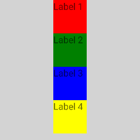

_Example for `orientation="horizontal"`_

```XML
<Page xmlns="http://schemas.nativescript.org/tns.xsd">
  <StackLayout orientation="horizontal" width="210" height="210" backgroundColor="lightgray">
    <Label text="Label 1" width="50" height="50" backgroundColor="red"/>
    <Label text="Label 2" width="50" height="50" backgroundColor="green"/>
    <Label text="Label 3" width="50" height="50" backgroundColor="blue"/>
    <Label text="Label 4" width="50" height="50" backgroundColor="yellow"/>
  </StackLayout>
</Page>
```





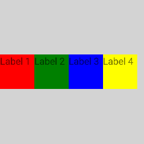

_Example for horizontal alignment of children_

```XML
<Page xmlns="http://schemas.nativescript.org/tns.xsd">
  <StackLayout orientation="vertical" width="210" height="210" backgroundColor="lightgray">
    <Label text="Label 1" horizontalAlignment="left" backgroundColor="red"/>
    <Label text="Label 2" horizontalAlignment="center" backgroundColor="green"/>
    <Label text="Label 3" horizontalAlignment="right" backgroundColor="blue"/>
    <Label text="Label 4" horizontalAlignment="stretch" backgroundColor="yellow"/>
  </StackLayout>
</Page>
```





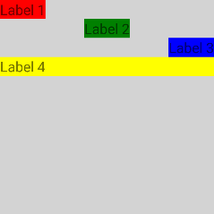

_Example for vertical alignment of children_

```XML
<Page xmlns="http://schemas.nativescript.org/tns.xsd">
  <StackLayout orientation="horizontal" width="210" height="210" backgroundColor="lightgray">
    <Label text="Label 1" verticalAlignment="top" backgroundColor="red"/>
    <Label text="Label 2" verticalAlignment="center" backgroundColor="green"/>
    <Label text="Label 3" verticalAlignment="bottom" backgroundColor="blue"/>
    <Label text="Label 4" verticalAlignment="stretch" backgroundColor="yellow"/>
  </StackLayout>
</Page>
```





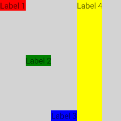

## [WrapLayout]()
The WrapLayout is similar to the StackLayout, but it does not just stack all child elements to one column/row, it wraps them to new columns/rows if no space is left. The WrapLayout is often used with items of the same size, but this is not a requirement.
### WrapLayout Properties
| Property    | Description |
| ----------- | ------------|
| orientation | Gets or sets a value indicating the flow direction. If orientation is `horizontal`, items are arranged in rows. If orientation is `vertical`, items are arranged in columns. The default value is `horizontal`. |
| itemWidth   | Gets or sets the width used to measure and layout each child. Default value is Number.NaN, which does not restrict children. |
| itemHeight  | Gets or sets the height used to measure and layout each child. Default value is Number.NaN, which does not restrict children. |

### Child Properties
None.

_Example for `orientation="horizontal"`_

```XML
<Page xmlns="http://schemas.nativescript.org/tns.xsd">
  <WrapLayout orientation="horizontal" width="210" height="210" backgroundColor="lightgray">
    <Label text="Label 1" width="70" height="70" backgroundColor="red"/>
    <Label text="Label 2" width="70" height="70" backgroundColor="green"/>
    <Label text="Label 3" width="70" height="70" backgroundColor="blue"/>
    <Label text="Label 4" width="70" height="70" backgroundColor="yellow"/>
  </WrapLayout>
</Page>
```





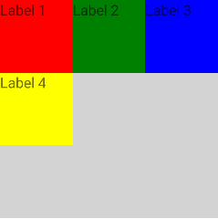

_Example for `orientation="vertical"`_

```XML
<Page xmlns="http://schemas.nativescript.org/tns.xsd">
  <WrapLayout orientation="vertical" width="210" height="210" backgroundColor="lightgray">
    <Label text="Label 1" width="70" height="70" backgroundColor="red"/>
    <Label text="Label 2" width="70" height="70" backgroundColor="green"/>
    <Label text="Label 3" width="70" height="70" backgroundColor="blue"/>
    <Label text="Label 4" width="70" height="70" backgroundColor="yellow"/>
  </WrapLayout>
</Page>
```





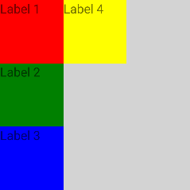

### Sample (itemWidth="30" itemHeight="30")

```XML
<Page xmlns="http://schemas.nativescript.org/tns.xsd">
  <WrapLayout itemWidth="30" itemHeight="30" width="210" height="210" backgroundColor="lightgray">
    <Label text="Label 1" width="70" height="70" backgroundColor="red"/>
    <Label text="Label 2" width="70" height="70" backgroundColor="green"/>
    <Label text="Label 3" width="70" height="70" backgroundColor="blue"/>
    <Label text="Label 4" width="70" height="70" backgroundColor="yellow"/>
  </WrapLayout>
</Page>
```





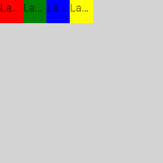

## [FlexboxLayout]()
The FlexboxLayout is a non-conforming implementation of the [CSS Flexible Box Layout](https://www.w3.org/TR/css-flexbox-1/) based on an existing Apache-2 licensed flexbox implementation hosted on [github.com/google/flexbox-layout](https://github.com/google/flexbox-layout).

### FlexboxLayout Properties
| Property    | Description |
| ----------- | ------------|
| flexDirection | Gets or sets a value indicating the direction flex items are placed in the flex container. The flexDirection property accepts 4 different values: `row` (same as text direction), `row-reverse` (opposite to text direction), `column` (same as `row` but top to bottom), and `column-reverse` (same as `row-reverse` top to bottom). The default value is `row`. |
| flexWrap | Gets or sets a value indicating whether the flex items are forced in a single line or can be flowed into multiple lines. If set to multiple lines, it also defines the cross-axis which determines the direction new lines are stacked in. The flexWrap property accepts 3 different values: `nowrap` (single-line which may cause the container to overflow), `wrap` (multi-lines, direction is defined by flexDirection), and `wrap-reverse` (multi-lines, opposite to direction defined by flexDirection). The default value is `nowrap`. |
| justifyContent | Gets or sets a value indicating the alignment along the main axis. It helps distribute extra free space leftover when either all the flex items on a line are inflexible, or are flexible but have reached their maximum size. It also exerts some control over the alignment of items when they overflow the line. The justifyContent property accepts 5 different values: `flex-start` (items are packed toward the start line), `flex-end` (items are packed toward to end line), `center` (items are centered along the line), `space-between` (items are evenly distributed in the line; first item is on the start line, last item on the end line), and `space-around` (items are evenly distributed in the line with equal space around them). The default value is `flex-start`. |
| alignItems | Gets or sets a value indicating how flex items are laid out along the cross axis on the current line. You can think of it as the justifyContent version for the cross-axis (perpendicular to the main-axis). The alignItems property accepts 5 different values: `flex-start` (cross-start margin edge of the items is placed on the cross-start line), `flex-end` (cross-end margin edge of the items is placed on the cross-end line), `center` (items are centered in the cross-axis), `baseline` (items are aligned such as their baselines align), `stretch` (stretch to fill the container but still respect min-width/max-width). The default value is `stretch`. |
| alignContent | Gets or sets a value that helps aligning a flex container's lines within it when there is extra space in the cross-axis, similar to how justifyContent aligns individual items within the main-axis. The alignContent property accepts 6 different values: `flex-start` (lines packed to the start of the container), `flex-end` (lines packed to the end of the container), `center` (lines packed to the center of the container), `space-between` (lines evenly distributed; the first line is at the start of the container while the last one is at the end), `space-around` (lines evenly distributed with equal space between them), and `stretch` (lines stretch to take up the remaining space). The default value is `stretch`. This property has no effect when the flexbox has only a single line. |

> **NOTE:** On **iOS**, you **cannot set** `alignItems` to `baseline`.

### Child Properties
| Property | Description |
| -------- | ------------|
| order         | Gets or sets a value that changes the default ordering of flex items. |
| flexGrow | Gets or sets a unitless value that serves as a proportion indicating whether the flex item is able to grow if necessary. It dictates what amount of the available space inside the flex container the item should take up. |
| flexShrink | Gets or sets a value indicating the "flex shrink factor", which determines how much the flex item will shrink relative to the rest of the flex items in the flex container when there is not enough space on the row. When omitted, it is set to 1 and the flex shrink factor is multiplied by the flex basis when distributing negative space. |
| alignSelf | Gets or sets a value that makes it possible to override the alignItems value for specific flex items. This property accepts the same 5 values as the alignItems: `flex-start` (cross-start margin edge of the item is placed on the cross-start line), `flex-end` (cross-end margin edge of the item is placed on the cross-end line), `center` (item is centered in the cross-axis), `baseline` (items are aligned such as their baseline are aligned), and `stretch` (stretch to fill the container but still respect min-width / max-width). The default value is `stretch`. |
| flexWrapBefore | Gets or sets a boolean value controlling item wrapping. Setting it to `true` on flexbox item will force it to wrap on a new line. The default value is `false`. This property is not part of the official flexbox specification.  

> **NOTE:** On **iOS**, you **cannot set** `alignSelf` to `baseline`.

_Example for `flexDirection="row"`, `alignItems="stretch"` (default)_

```XML
<Page xmlns="http://schemas.nativescript.org/tns.xsd">
  <FlexboxLayout width="300" height="300" backgroundColor="lightgray">
    <Label text="Label 1" width="70" height="70" backgroundColor="red"/>
    <Label text="Label 2" width="70" height="70" backgroundColor="green"/>
    <Label text="Label 3" width="70" height="70" backgroundColor="blue"/>
    <Label text="Label 4" width="70" height="70" backgroundColor="yellow"/>
  </FlexboxLayout>
</Page>
```





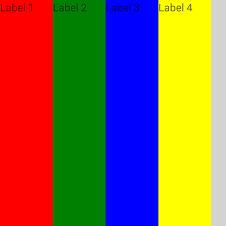

_Example for `flexDirection="column"`, `alignItems="stretch"` (default)_

```XML
<Page xmlns="http://schemas.nativescript.org/tns.xsd">
  <FlexboxLayout flexDirection="column" width="300" height="300" backgroundColor="lightgray">
    <Label text="Label 1" width="70" height="70" backgroundColor="red"/>
    <Label text="Label 2" width="70" height="70" backgroundColor="green"/>
    <Label text="Label 3" width="70" height="70" backgroundColor="blue"/>
    <Label text="Label 4" width="70" height="70" backgroundColor="yellow"/>
  </FlexboxLayout>
</Page>
```






### Sample (flexDirection="row", alignItems="flex-start")

```XML
<Page xmlns="http://schemas.nativescript.org/tns.xsd">
  <FlexboxLayout alignItems="flex-start" width="300" height="300" backgroundColor="lightgray">
    <Label text="Label 1" width="70" height="70" backgroundColor="red"/>
    <Label text="Label 2" width="70" height="70" backgroundColor="green"/>
    <Label text="Label 3" width="70" height="70" backgroundColor="blue"/>
    <Label text="Label 4" width="70" height="70" backgroundColor="yellow"/>
  </FlexboxLayout>
</Page>
```





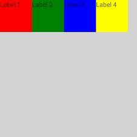

_Example for `flexDirection="row"`, custom order_

```XML
<Page xmlns="http://schemas.nativescript.org/tns.xsd">
  <FlexboxLayout alignItems="flex-start" width="300" height="300" backgroundColor="lightgray">
    <Label order="3" text="Label 1" width="70" height="70" backgroundColor="red"/>
    <Label order="4" text="Label 2" width="70" height="70" backgroundColor="green"/>
    <Label order="2" text="Label 3" width="70" height="70" backgroundColor="blue"/>
    <Label order="1" text="Label 4" width="70" height="70" backgroundColor="yellow"/>
  </FlexboxLayout>
</Page>
```





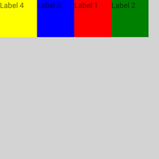

_Example for `flexWrap="wrap"`_

```XML
<Page xmlns="http://schemas.nativescript.org/tns.xsd">
  <FlexboxLayout flexWrap="wrap" height="300" width="300" backgroundColor="lightgray">
    <Label text="Label 1" width="100" height="50" backgroundColor="red"/>
    <Label text="Label 2" width="100" height="50" backgroundColor="green"/>
    <Label text="Label 3" width="100" height="50" backgroundColor="blue"/>
    <Label text="Label 4" width="100" height="50" backgroundColor="yellow"/>
  </FlexboxLayout>
</Page>
```





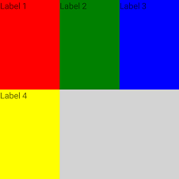

_Example for `flexDirection="column-reverse"`, `justifyContent="space-around"`, `alignSelf`_

```XML
<Page xmlns="http://schemas.nativescript.org/tns.xsd">
  <FlexboxLayout flexDirection="column-reverse" justifyContent="space-around" alignItems="stretch"
    height="300" width="300" backgroundColor="lightgray">
    <Label text="Label 1" width="50" height="50" backgroundColor="red"/>
    <Label alignSelf="center" text="Label 2" width="50" height="50" backgroundColor="green"/>
    <Label alignSelf="flex-end" text="Label 3" width="50" height="50" backgroundColor="blue"/>
    <Label text="Label 4" width="50" height="50" backgroundColor="yellow"/>
  </FlexboxLayout>
</Page>
```






